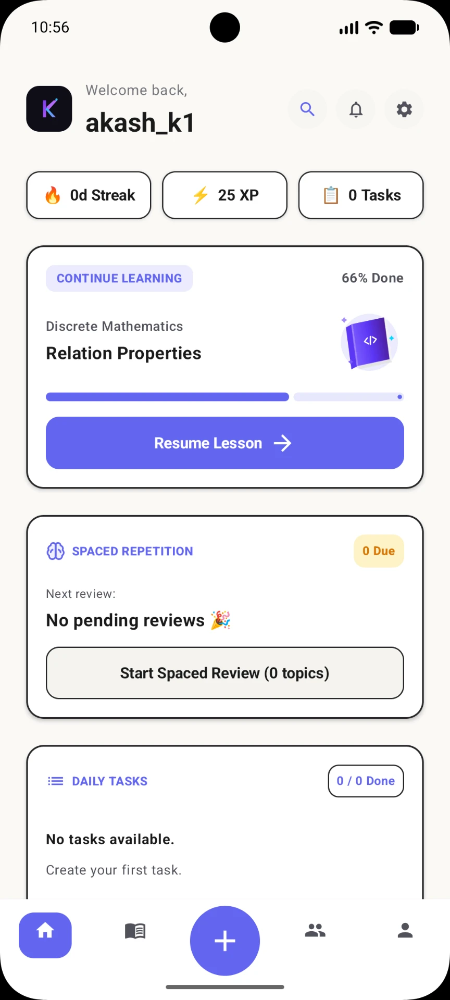
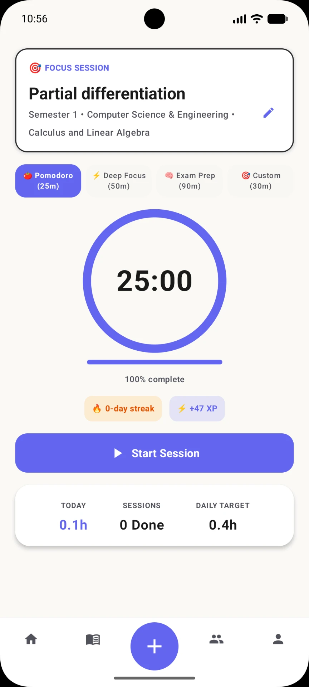
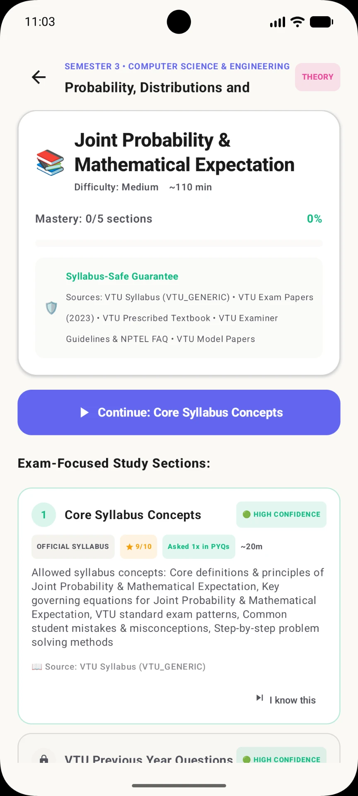

# Kletaq

Turn your syllabus into quests.

Kletaq transforms subjects, modules, and backlogs into a visual learning journey built for engineering students. Instead of static PDFs and overwhelming syllabi, Kletaq converts your semester into structured quests with progress tracking, focus sessions, and personalized learning paths.

## Features

- 📚 Visual semester roadmap
- 🎯 Convert subjects into quests and modules
- 🔥 Daily streaks and study statistics
- ⏱️ Focus timer with Pomodoro sessions
- 📈 Progress tracking across semesters
- 📝 Backlog management
- 🏆 XP and gamified learning
- 📱 Mobile-first interface

## Screenshots

| Home | Focus Timer | Quest Overview |
|------|------|------|
|  |  |  |

## Philosophy

Kletaq follows a simple philosophy:

- 70% engineering notebook
- 20% productivity tool
- 10% RPG progression

The goal is to make studying feel less like memorization and more like completing meaningful quests.

## Tech Stack

- React
- TypeScript
- TanStack Start
- Vite
- Tailwind CSS
- Cloudflare Pages

## Local Development

Clone the repository:

```bash
git clone https://github.com/Akashkatageri/ketlaq-website.git
cd ketlaq-website
```

Install dependencies:

```bash
npm install
```

Run the development server:

```bash
npm run dev
```

Build for production:

```bash
npm run build
```

## Deployment

Kletaq is deployed on Cloudflare Pages.

Website:

https://kletaq.5122006.xyz

## Vision

Engineering students spend more time figuring out **what to study** than actually studying.

Kletaq aims to solve that problem by turning complex syllabi into structured learning journeys that make progress visible and motivation sustainable.

---

Built by a student, for students.
